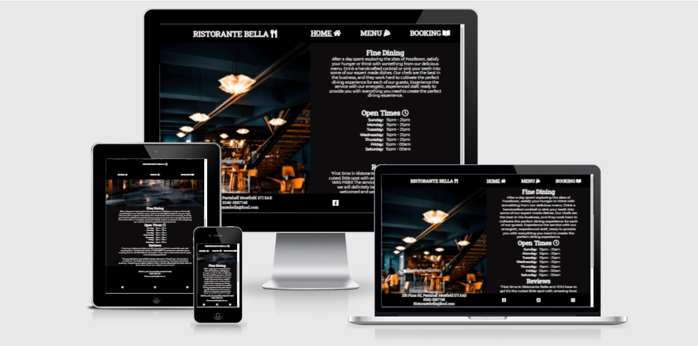
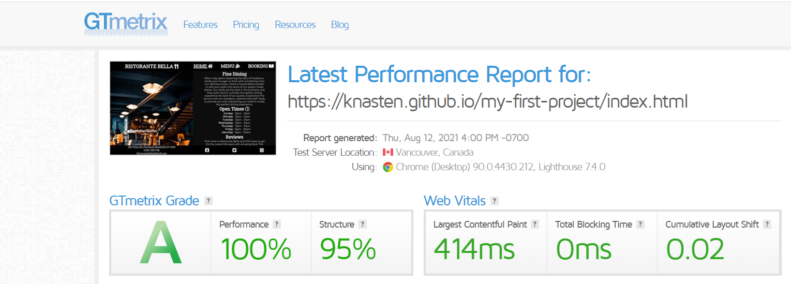
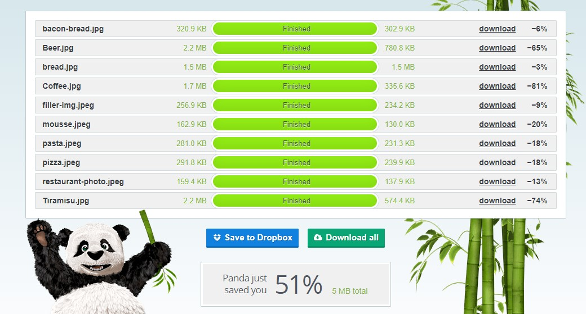

# Ristorante Bella
# [LINK FOR LIVE VIEW](https://knasten.github.io/Ristorante-Bella/)

Made as a first project in my course on becoming an Full-Stacked-devloper.
On this website potential customers will be able to find any information needed before deciding if they wanna try our food. As well as be able to book a table for future visits.

# Content
1. Features
2. Testing
3. Bugs
4. Validation
5. Tools
6. Deployment
7. Credits

# Features
* Navigation

    * At the top left you can click the title name to access the home page

    * At the top right you will find links to home, menu and booking.
    These links will take you to the different pages of the website.

    * As far as styling goes for navigation it has a dark background with white font color and a higher font weight.

    * Made to make the user experience better and more compelling 

    

* Home Page

    * On this page you will find a background image to the left. Put there to fill out the page and make it look more appealing.

    * On the right side you can find the open times for Ristorante Bella as well as some feedback from previous customers.

    

* Menu Page

    * It is split up into four sections, one for each type of product.
        * Appetizers
        * Mains
        * Desserts
        * Drinks

    * You will find the price of each item and will also be able to see some of the main ingredients in each meal.

    
* Booking Page
    * On this page you will find a map on the left side with our location to make sure customers can find you.
    * On the right side you will be able to book a table, you can choose party size, if any of you have any allergies and of course also add your contact information.
    * In the middle of the map and form there is a small text containing some information about address and phone number to order food.

    

* Footer
    * You will find the contact information on every page at the bottom. Made to make it easier for the user to find the most important information.
    * In the bottom right you will also find our social media links.

    

# Testing

* I tested the responsiveness of the page in chrome devtools using all the standard screen sizes.
* This page was tested in different browsers: Chrome, Firefox and Edge
* I tested the form and confirmed that it only accepts the wanted data in every field.

# Bugs

* After deploying my project to Github Pages, I saw that my project didn't resize as expected, as well as a few aligning problems with the form.
    * After looking over the code I found the problem. It was my mediaqueries label width and after setting this right, it aligned as it should.
    * I also had a problem with font sizing as it would make text stick out from the footer and compress the text in the header.
    
    * Changing the width in my mediaqueries for smaller screen as well as my font-size in body element fixed the problems.
* No bugs was left unfixed.
# Validation

* HTML
    * No errors when testing it through the offical W3C validator
    
* Accessibility
    * I made sure my chosen colors and fonts are easy to read by running it through lighthouse extension on chrome.
    
    * Also made an extra performance test on Gtmetrix 

# Tools

* I used GitPod to write the code for my website below you can see which languages were used to make this website.
    * HTML5
    * CSS3

* I used [GitHub](https://github.com/) to deploy my website.
* I used [GoogleAPI](https://developers.google.com/maps/documentation/embed/map-generator) for my Iframe google map
* I used [GoogleFonts](https://fonts.google.com/) for the fonts on my website
* I used [FontAwesome Ver.5.15.4](https://fontawesome.com/) for the icons you can see next to all site links and also in the footer for the social media links
* I used [TinyPNG](https://tinypng.com/) to make my images smaller for faster loading speeds.

* I also gathered information on flex-grid on the web especially from [CSS-Tricks](https://css-tricks.com/snippets/css/a-guide-to-flexbox/)

# Deployment

* This site was deployed to GitHub pages. Steps to deploy are as follows:
    * Go to GitHub repository and choose settings
    * From settings, choose pages tab
    * Select branch main from the menu
    * You now have a clickable live link

# Credits

* Text under heading "Fine Dining" was borrowed from [Hardrock Café](https://www.hardrockcafe.com/location/stockholm/)
* Text under "Reviews" was borrowed from [Eat_Sleep_Wander](https://eatsleepwander.com/good-restaurant-review-examples-to-copy-paste/)
* All images you see on this site was taken from [Pexels](https://www.pexels.com/)

 